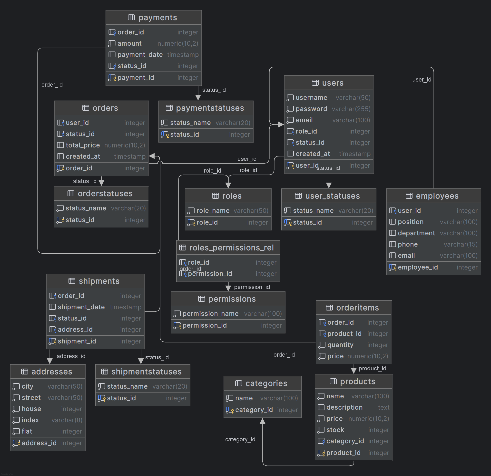

# Схема базы данных

Представлена схема базы данных для интернет-магазина. 
Работу выполнил Счётов Всеволод Евгеньевич ЭФМО-02-24

## 1. Roles (Роли)
_Таблица для хранения ролей пользователей в системе._
- `role_id` (INT, Primary Key): Уникальный идентификатор роли.
- `role_name` (VARCHAR(50), NOT NULL): Название роли (например, Админ, Пользователь, Менеджер).

## 2. Permissions (Права)
_Определяет права, которые могут быть назначены ролям._
- `permission_id` (INT, Primary Key): Уникальный идентификатор права.
- `permission_name` (VARCHAR(100), NOT NULL): Описание права (например, Просмотр пользователей, Редактирование списка товаров).

## 3. Roles_Permissions_Rel (Связь Ролей и Прав)
_Таблица, описывающая связь "многие ко многим" между ролями и правами._
- `role_id` (INT): Внешний ключ, ссылающийся на `Roles(role_id)`.
- `permission_id` (INT): Внешний ключ, ссылающийся на `Permissions(permission_id)`.

## 4. User_Statuses (Статусы Пользователей)
_Определяет различные статусы пользователей._
- `status_id` (INT, Primary Key): Уникальный идентификатор статуса.
- `status_name` (VARCHAR(20), NOT NULL): Название статуса (например, Активен, Неактивен, Заблокирован).

## 5. Users (Пользователи)
_Таблица для хранения информации о пользователях._
- `user_id` (INT, Primary Key, Автоинкремент): Уникальный идентификатор пользователя.
- `username` (VARCHAR(50), NOT NULL): Имя пользователя.
- `password` (VARCHAR(255), NOT NULL): Хешированный пароль пользователя.
- `email` (VARCHAR(100), NOT NULL): Электронная почта пользователя.
- `role_id` (INT): Внешний ключ, ссылающийся на `Roles(role_id)`.
- `status_id` (INT): Внешний ключ, ссылающийся на `User_Statuses(status_id)`.
- `created_at` (TIMESTAMP, По умолчанию: `CURRENT_TIMESTAMP`): Дата и время создания пользователя.

## 6. Categories (Категории)
_Таблица для хранения информации о категориях товаров._
- `category_id` (INT, Primary Key, Автоинкремент): Уникальный идентификатор категории.
- `name` (VARCHAR(100), NOT NULL): Название категории.

## 7. Products (Товары)
_Таблица для хранения информации о товарах._
- `product_id` (INT, Primary Key, Автоинкремент): Уникальный идентификатор товара.
- `name` (VARCHAR(100), NOT NULL): Название товара.
- `description` (TEXT): Описание товара.
- `price` (DECIMAL(10, 2), NOT NULL): Цена товара.
- `stock` (INT, NOT NULL): Количество товара на складе.
- `category_id` (INT): Внешний ключ, ссылающийся на `Categories(category_id)`.

## 8. OrderStatuses (Статусы Заказов)
_Таблица для хранения возможных статусов заказов._
- `status_id` (INT, Primary Key, Автоинкремент): Уникальный идентификатор статуса заказа.
- `status_name` (VARCHAR(20), NOT NULL): Название статуса (например, В ожидании, Отправлен, Доставлен).

## 9. Orders (Заказы)
_Таблица для хранения информации о заказах._
- `order_id` (INT, Primary Key, Автоинкремент): Уникальный идентификатор заказа.
- `user_id` (INT): Внешний ключ, ссылающийся на `Users(user_id)`.
- `status_id` (INT): Внешний ключ, ссылающийся на `OrderStatuses(status_id)`.
- `total_price` (DECIMAL(10, 2)): Общая стоимость заказа.
- `created_at` (TIMESTAMP, По умолчанию: `CURRENT_TIMESTAMP`): Дата и время создания заказа.

## 10. OrderItems (Элементы Заказа)
_Таблица для хранения информации о товарах в заказе._
- `order_id` (INT): Внешний ключ, ссылающийся на `Orders(order_id)`.
- `product_id` (INT): Внешний ключ, ссылающийся на `Products(product_id)`.
- `quantity` (INT, NOT NULL): Количество товара в заказе.
- `price` (DECIMAL(10, 2), NOT NULL): Цена товара на момент заказа.

## 11. PaymentStatuses (Статусы Оплаты)
_Таблица для определения статусов оплаты._
- `status_id` (INT, Primary Key, Автоинкремент): Уникальный идентификатор статуса оплаты.
- `status_name` (VARCHAR(20), NOT NULL): Название статуса оплаты (например, Ожидается, Завершено, Ошибка).

## 12. Payments (Оплаты)
_Таблица для хранения информации о платежах._
- `payment_id` (INT, Primary Key, Автоинкремент): Уникальный идентификатор оплаты.
- `order_id` (INT): Внешний ключ, ссылающийся на `Orders(order_id)`.
- `amount` (DECIMAL(10, 2), NOT NULL): Сумма оплаты.
- `payment_date` (TIMESTAMP, По умолчанию: `CURRENT_TIMESTAMP`): Дата и время совершения оплаты.
- `status_id` (INT): Внешний ключ, ссылающийся на `PaymentStatuses(status_id)`.

## 13. ShipmentStatuses (Статусы Доставки)
_Таблица для определения статусов доставки._
- `status_id` (INT, Primary Key, Автоинкремент): Уникальный идентификатор статуса доставки.
- `status_name` (VARCHAR(20), NOT NULL): Название статуса доставки (например, Отправлено, Доставлено, Возвращено).

## 14. Addresses (Адреса)
_Таблица для хранения адресов доставки._
- `address_id` (INT, Primary Key, Автоинкремент): Уникальный идентификатор адреса.
- `city` (VARCHAR(50), NOT NULL): Название города.
- `street` (VARCHAR(50), NOT NULL): Название улицы.
- `house` (INT, NOT NULL): Номер дома.
- `index` (VARCHAR(8), NOT NULL): Почтовый индекс.
- `flat` (INT, NOT NULL): Номер квартиры.

## 15. Shipments (Доставка)
_Таблица для хранения информации о доставках._
- `shipment_id` (INT, Primary Key, Автоинкремент): Уникальный идентификатор доставки.
- `order_id` (INT): Внешний ключ, ссылающийся на `Orders(order_id)`.
- `shipment_date` (TIMESTAMP, По умолчанию: `CURRENT_TIMESTAMP`): Дата и время отправки.
- `status_id` (INT): Внешний ключ, ссылающийся на `ShipmentStatuses(status_id)`.
- `address_id` (INT): Внешний ключ, ссылающийся на `Addresses(address_id)`.

## 16. Employees (Сотрудники)
_Таблица для хранения информации о сотрудниках._
- `employee_id` (INT, Primary Key, Автоинкремент): Уникальный идентификатор сотрудника.
- `user_id` (INT): Внешний ключ, ссылающийся на `Users(user_id)`.
- `position` (VARCHAR(100)): Должность сотрудника.
- `department` (VARCHAR(100)): Отдел, в котором работает сотрудник.
- `phone` (VARCHAR(15)): Номер телефона сотрудника.
- `email` (VARCHAR(100)): Электронная почта сотрудника.
