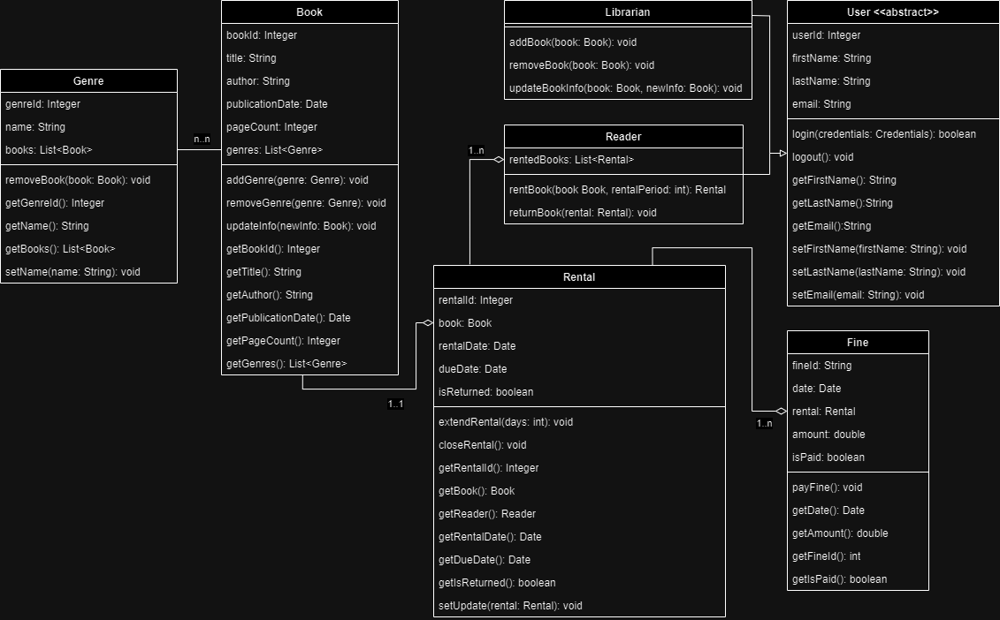

# Система управления библиотекой - Описание UML-диаграммы классов

Этот документ описывает UML-диаграмму классов для системы управления библиотекой. Система предназначена для управления книгами, жанрами, пользователями (как читателями, так и библиотекарями), прокатом книг и штрафами. Ниже приведены основные компоненты диаграммы, их атрибуты, методы и взаимосвязи.

---

---

## 1. Классы и атрибуты

### a. `Книга` (Book)
Представляет книгу в системе.

- **Атрибуты:**
    - `bookId: Integer` — Уникальный идентификатор книги.
    - `title: String` — Название книги.
    - `author: String` — Автор книги.
    - `publicationDate: Date` — Дата публикации.
    - `pageCount: Integer` — Количество страниц.
    - `genres: List<Genre>` — Список жанров, к которым относится книга.

- **Методы:**
    - `addGenre(genre: Genre): void` — Добавить жанр к книге.
    - `removeGenre(genre: Genre): void` — Удалить жанр из книги.
    - `updateInfo(newInfo: Book): void` — Обновить информацию о книге.
    - `getBookId(): Integer` — Получить идентификатор книги.
    - `getTitle(): String` — Получить название книги.
    - `getAuthor(): String` — Получить автора книги.
    - `getPublicationDate(): Date` — Получить дату публикации.
    - `getPageCount(): Integer` — Получить количество страниц.
    - `getGenres(): List<Genre>` — Получить список жанров книги.

### b. `Жанр` (Genre)
Представляет жанр книги.

- **Атрибуты:**
    - `genreId: Integer` — Уникальный идентификатор жанра.
    - `name: String` — Название жанра (например, фантастика, детектив и т.д.).
    - `books: List<Book>` — Список книг, относящихся к жанру.

- **Методы:**
    - `addBook(book: Book): void` — Связать книгу с жанром.
    - `removeBook(book: Book): void` — Убрать книгу из жанра.
    - `getGenreId(): Integer` — Получить идентификатор жанра.
    - `getName(): String` — Получить название жанра.
    - `getBooks(): List<Book>` — Получить список книг жанра.
    - `setName(name: String): void` — Установить название жанра.

### c. Абстрактный класс `Пользователь` (User)
Представляет пользователя системы.

- **Атрибуты:**
    - `userId: Integer` — Уникальный идентификатор пользователя.
    - `firstName: String` — Имя пользователя.
    - `lastName: String` — Фамилия пользователя.
    - `email: String` — Электронная почта пользователя.

- **Методы:**
    - `login(credentials: Credentials): boolean` — Вход в систему.
    - `logout(): void` — Выход из системы.
    - `getFirstName(): String` — Получить имя пользователя.
    - `getLastName(): String` — Получить фамилию пользователя.
    - `getEmail(): String` — Получить электронную почту пользователя.
    - `setFirstName(firstName: String): void` — Установить имя пользователя.
    - `setLastName(lastName: String): void` — Установить фамилию пользователя.
    - `setEmail(email: String): void` — Установить электронную почту пользователя.

### d. `Читатель` (Reader)
Представляет читателя, который может арендовать книги.

- **Наследование:** Наследуется от абстрактного класса `Пользователь` (User).

- **Атрибуты:**
    - `rentedBooks: List<Rental>` — Список арендованных читателем книг.

- **Методы:**
    - `rentBook(book: Book, rentalPeriod: int): Rental` — Арендовать книгу на определенный срок.
    - `returnBook(rental: Rental): void` — Вернуть арендованную книгу.
    - `getRentedBooks(): List<Rental>` — Получить список арендованных книг.

### e. `Библиотекарь` (Librarian)
Представляет библиотекаря, который управляет книгами в библиотеке.

- **Наследование:** Наследуется от абстрактного класса `Пользователь` (User).

- **Методы:**
    - `addBook(book: Book): void` — Добавить новую книгу в библиотеку.
    - `removeBook(book: Book): void` — Удалить книгу из библиотеки.
    - `updateBookInfo(book: Book, newInfo: Book): void` — Обновить информацию о книге.
    - `getAllBooks(): List<Book>` — Получить список всех книг в библиотеке.

### f. `Аренда` (Rental)
Представляет процесс аренды книги пользователем.

- **Атрибуты:**
    - `rentalId: Integer` — Уникальный идентификатор аренды.
    - `book: Book` — Книга, которая была арендована.
    - `reader: Reader` — Читатель, взявший книгу в аренду.
    - `rentalDate: Date` — Дата начала аренды.
    - `dueDate: Date` — Срок возврата книги.
    - `isReturned: Boolean` — Статус возврата книги (возвращена или нет).

- **Методы:**
    - `extendRental(days: int): void` — Продлить срок аренды.
    - `closeRental(): void` — Завершить аренду.
    - `getRentalId(): Integer` — Получить идентификатор аренды.
    - `getBook(): Book` — Получить арендованную книгу.
    - `getReader(): Reader` — Получить читателя, арендовавшего книгу.
    - `getRentalDate(): Date` — Получить дату начала аренды.
    - `getDueDate(): Date` — Получить срок возврата книги.
    - `getIsReturned(): Boolean` — Получить статус возврата книги.
    - `updateRentalDetails(rental: Rental): void` — Обновить детали аренды.

### g. `Штраф` (Fine)
Представляет штраф за просрочку возврата книги.

- **Атрибуты:**
    - `fineId: Integer` — Уникальный идентификатор штрафа.
    - `date: Date` — Дата начисления штрафа.
    - `rental: Rental` — Аренда, за которую начислен штраф.
    - `amount: Double` — Сумма штрафа.
    - `isPaid: Boolean` — Статус оплаты штрафа.

- **Методы:**
    - `payFine(): void` — Оплатить штраф.
    - `getDate(): Date` — Получить дату штрафа.
    - `getAmount(): Double` — Получить сумму штрафа.
    - `getFineId(): Integer` — Получить идентификатор штрафа.
    - `getIsPaid(): Boolean` — Получить статус оплаты штрафа.

---

## 2. Взаимосвязи между классами

### a. Наследование
- **`Пользователь` → `Читатель` и `Библиотекарь`:**
    - `Читатель` и `Библиотекарь` являются подклассами абстрактного класса `Пользователь`, наследуя его атрибуты и методы, а также добавляя свои специфичные функции.

### b. Ассоциации
- **`Читатель` ↔ `Аренда`:**
    - Один `Читатель` может иметь несколько `Аренд` (мультипликативность 1..n), то есть читатель может арендовать несколько книг одновременно или последовательно.
    - Каждая `Аренда` связана только с одним `Читателем`.

- **`Аренда` ↔ `Книга`:**
    - Каждая `Аренда` связана с одной `Книгой`, то есть аренда относится к конкретной книге.
    - Одна `Книга` может быть арендована многократно, но в каждый момент времени она может быть арендована только одной `Арендой`.

- **`Штраф` ↔ `Читатель` и `Аренда`:**
    - Один `Читатель` может иметь несколько `Штрафов` (1..n).
    - Каждый `Штраф` связан с одной `Арендой`, за которую был начислен штраф.

- **`Книга` ↔ `Жанр`:**
    - Связь многие-ко-многим (`n..n`): одна книга может относиться к нескольким жанрам, и один жанр может включать несколько книг.
    - Реализовано через атрибут `genres` в классе `Книга` и атрибут `books` в классе `Жанр`.

### c. Агрегация
- **`Жанр` агрегирует `Книгу`:**
    - Это отражает, что жанр может включать в себя несколько книг, а книга может принадлежать нескольким жанрам, без строгой зависимости жизненного цикла между ними.

---

## 3. Функции системы

Система управления библиотекой предоставляет следующие основные функции:

1. **Управление книгами:**
    - **Добавление книг:** Библиотекари могут добавлять новые книги в библиотеку с полной информацией.
    - **Редактирование информации:** Библиотекари могут обновлять информацию о существующих книгах.
    - **Удаление книг:** Библиотекари могут удалять книги из системы.

2. **Управление жанрами:**
    - **Добавление жанров:** Создание новых жанров для классификации книг.
    - **Привязка книг к жанрам:** Ассоциирование книг с соответствующими жанрами.

3. **Управление пользователями:**
    - **Регистрация читателей и библиотекарей:** Создание учетных записей для пользователей системы.
    - **Авторизация:** Пользователи могут входить и выходить из системы.

4. **Аренда книг:**
    - **Прокат книг:** Читатели могут арендовать доступные книги на определенный срок.
    - **Возврат книг:** Читатели могут возвращать арендованные книги.
    - **Продление аренды:** Возможность продления срока аренды книг.

5. **Управление штрафами:**
    - **Начисление штрафов:** Система автоматически начисляет штрафы за просрочку возврата книг.
    - **Оплата штрафов:** Читатели могут оплачивать начисленные штрафы.

